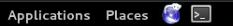
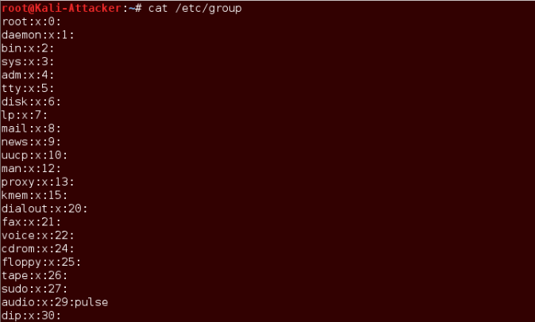

Lab 02: Password Cracking with Linux

1.  Cracking Linux Passwords

    1.  Creating User Accounts and Groups

<!-- -->

1.  Launch the Kali virtual Machine to access the graphical login
    screen.

2.  Log in as root with that password toor.

3.  Open a new terminal window by clicking on the terminal icon located
    in the top menu pane.

>  style="width:2.42742in;height:0.27087in" />

4.  Type the command below, followed by pressing the Enter key to view
    the groups on the system.

> root@Kali Attacker:~# cat /etc/ group

5.  Enter the command below to p juniors and seniors . opulate the group
    list by creating two new groups

    1.  root@Kali Attacker:~# groupadd juniors

    2.  root@Kali Attacker:~# groupadd seniors

>  style="width:3.42756in;height:0.50007in" />

6.  Confirm that the groups have been added using grep .

> root@Kali Attacker:~# cat /etc/group \| grep “ seniors ”
>
>  style="width:4.84443in;height:0.56258in" />
>
> root@Kali Attacker:~# cat /etc/group \| grep “juniors”
>
>  style="width:4.71941in;height:0.60425in" />

7.  Enter the command below to view the user accounts on the system.

> root@Kali Attacker:~# cat /etc/passwd
>
> 

8.  Add users **elmo** and **Oscar** to the system and assign them to
    the group **seniors**.

> root@Kali Attacker:~# useradd elmo g seniors
>
> root@Kali Attacker:~# useradd oscar g seniors
>
>  style="width:4.16725in;height:0.50007in" />

9.  Add users l isa and homer and assign them to the group juniors

> root@Kali Attacker:~# useradd lisa g juniors
>
> root@Kali Attacker:~# useradd homer g juniors
>
>  style="width:4.13599in;height:0.60425in" />

10. View the created . /etc/ passwd file once more to verify that all
    accounts are successfully

> root@Kali Attacker:~# cat /etc/passwd
>
>  style="width:3.45882in;height:0.93763in" />
>
> 11\. View the /etc/shadow file and observe the values next to the
> newly created accounts towards the bottom of the list
>
> root@Kali-Attacker:~# cat /etc/shadow
>
>  alt="A screenshot of a computer Description automatically generated" />
>
> 12\. Configure passwords for the users: elmo, oscar, lisa, and homer.
> First, begin by configuring the password for the elmo user account.
>
> root@Kali-Attacker:~# passwd elmo
>
> 13\. When prompted for the new password, type 123123 followed by
> pressing the Enter key. When prompted to retype the password, enter it
> again.
>
>  alt="A close-up of a computer screen Description automatically generated" />
>
> 14\. Configure the password for oscar next. When prompted, enter
> sanjose as the password.
>
> root@Kali-Attacker:~# passwd oscar
>
> 15\. Configure the password for lisa. When prompted, enter academic as
> the password.
>
> root@Kali-Attacker:~# passwd lisa
>
> 16\. Configure the password for homer. When prompted, enter acapulco
> as the password.
>
> root@Kali-Attacker:~# passwd homer
>
> 17\. Type the command below to view the new user accounts along with
> their respective hashes in the shadow file. The command options used
> below will only output the last four accounts in the shadow file.
>
>  alt="A computer screen with white text Description automatically generated" />
>
> 18\. Leave the terminal open to continue with the next task.

1.2. **Cracking Passwords on a Linux System Using John the Ripper**

> **1.** Before using John the Ripper, using the terminal, type the
> command below to view the available options that can be used with the
> application. This is useful when using any command in Linux.
>
> **root@Kali-Attacker:~# john -help**
>
>  alt="A computer screen shot of a computer screen Description automatically generated" />
>
> 2\. Run John the Ripper against the /etc/shadow file using a wordlist
> called passlist.
>
>  alt="A computer screen with white text Description automatically generated" />

3\. Leave the terminal open to continue with the next task.

2\. **Cracking Windows Passwords**

**2.1. Cracking Windows Passwords Using Hashcat**

1\. While on the Kali system, focus on the terminal window.

2\. Change to the /tmp/hashes directory.

root@Kali-Attacker:/tmp/hashes# cat winhashes

>  alt="A screenshot of a computer screen Description automatically generated" />
>
> 3\. View the winhashes file extracted from a Windows system. Notice
> the usernames listed along with the associated password hashes.

root@Kali-Attacker:/tmp/hashes# cat winhashes

>  alt="A computer screen with white text Description automatically generated" />

4\. Parse out the NTHash from the winhashes file.

> root@Kali-Attacker:/tmp/hashes# cat winhashes \| awk –F”:” ‘{print
> \$3}’
>
>  alt="A computer screen with white text Description automatically generated" />
>
> 5\. Now that we have confirmed what is needed to be parsed out, save
> the output to a file named nthashes.
>
>  style="width:7.90278in;height:0.65278in" />

6\. Verify that the NTHashes have outputted correctly in the nthashes
file.

root@Kali-Attacker:/tmp/hashes# cat nthashes

>  alt="A computer screen with white text Description automatically generated" />
>
> 7\. Run the Hashcat password cracking program against the nthashes
> file with the help of the passlist dictionary file in an attempt to
> crack the NTHashes from a Windows system. If asked to accept a EULA,
> type **YES** followed by pressing Enter.

root@Kali-Attacker:/tmp/hashes# hashcat –m 1000 nthashes

/tmp/wordlists/passlist

8\. Leave the terminal open to continue with the next task.

3\. **Obtaining and Cracking Linux /etc/shadow**

3.1. **Obtaining the /etc/shadow Remotely**

1\. Launch the DVL virtual machine.

2\. Log in as root, using toor as the password.

> 3\. At the prompt, type **startx** followed by pressing the **Enter**
> key to launch the GUI.
>
> 4\. Open a new terminal window by clicking on the **Terminal** icon
> located on the bottom menu pane.
>
>  alt="A screen shot of a computer Description automatically generated" />
>
>  style="width:3.45833in;height:0.36111in" />

5\. Type the command below to initialize the FTP service.

bt ~# proftpd

>  alt="A black background with white text Description automatically generated" />

6.  Change focus to the Kali system.

> 7\. While on the Kali system, focus on the terminal window. Remotely
> FTP into the DVL Server. When asked for a username, type root followed
> by pressing Enter. When prompted for the password, type toor followed
> by pressing Enter.
>
> root@Kali-Attacker:/tmp/hashes# ftp 10.1.1.10

8\. Once connected to the DVL system via FTP, print the current
directory.

ftp\> pwd

>  alt="A close up of a sign Description automatically generated" />

9\. Change to the /etc directory.

ftp\> cd /etc

>  alt="A black background with white text Description automatically generated" />

10\. Download the local shadow file on the DVL system via FTP.

ftp\> get shadow

>  alt="A screen shot of a computer Description automatically generated" />

11\. After the shadow file successfully downloads, close the FTP
session.

ftp\> exit

>  alt="A red and blue text Description automatically generated" />
>
> 12\. Verify that the shadow file has transferred into the current
> directory (/tmp/hashes).
>
> root@Kali-Attacker:/tmp/hashes# ls -l
>
>  alt="A screenshot of a computer screen Description automatically generated" />

13\. Leave the terminal open to continue with the next task.

3.2. **Cracking /etc/shadow With Johnny**

> 1\. While on the Kali system, observe the content of the recently
> transferred shadow file. Notice the list of users.

root@Kali-Attacker:/tmp/hashes# cat shadow

>  alt="A screenshot of a computer Description automatically generated" />
>
> 2\. Start the GUI password cracking application, johnny. This is the
> same as John the Ripper but with a graphical user interface. Type the
> command below in the terminal window. Press Enter
>
> root@Kali-Attacker:/tmp/hashes# johnny

3\. A new window appears. Click on the **Open Passwd File** icon.

4\. In the new *Open* window, navigate to the **/tmp/hashes** directory.
Select the **shadow**

> file and click on the **Open** button.
>
>  alt="A screenshot of a computer Description automatically generated" />
>
> 5\. On the Passwords screen, notice how each column is populated with
> its associated values. Click on the Options icon located in the left
> pane.

6.  On the Options screen, select the radio button next to Wordlist
    mode. Notice the

pane on the bottom changes to the Wordlist tab.

7\. In the bottom pane, click on the Browse button.

8.  In the Open window, navigate to the /tmp/wordlists directory. Select
    the passlist file and click on the Open button.

>  alt="A screenshot of a computer Description automatically generated" />
>
> 9\. Verify that the Wordlist file is assigned to
> /tmp/wordlists/passlist. Click the Start Attack icon located on the
> top menu

10\. Notice the progression bar at the bottom. When it reaches 100%,
click the

Passwords icon from the menu located on the left to view the results.

